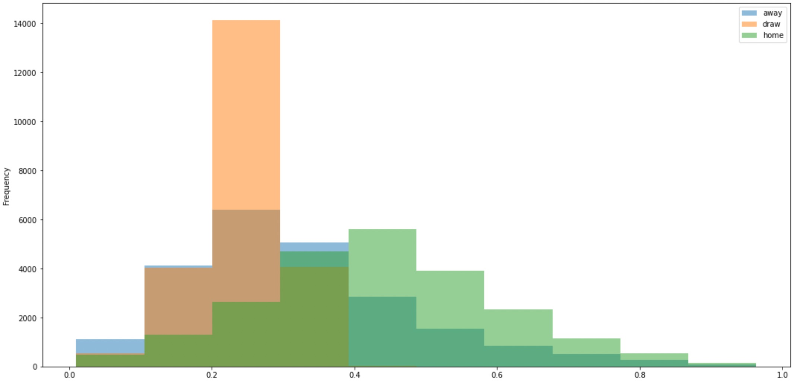

## “Football Match Probability Prediction”项目报告

### 1. 问题提出

#### 1.1 问题背景及分析

足球是全世界最受欢迎也是商业价值最高的运动，“足球是圆的”，这句话的意思是足球场上有着无限的可能性，所以关于足球比赛的预测也成了一件很有意思的事。

多年来，足球一直是数据科学的核心。 今天的算法专注于事件检测、球员风格或球队分析，预测比赛结果仍然是一个开放的挑战。

预测两支球队之间比赛的结果主要（但不仅）取决于他们目前的形式，还要考虑到他们的赛程，比赛的顺序可能会导致两支球队之间的比赛结果有所不同。

本项目是关于使用球队最近的 10 场比赛的序列来预测超过 150000 场比赛结果的概率。 我们的目标是预测目标列中每场比赛结果的概率：`主场获胜(home to win)`、`平局(draw)`和`客场获胜(away to win)`的概率。

#### 1.2 问题描述

该数据集包含 2019 年至 2021 年超过 15 万场历史性的世界足球比赛，涉及 860 多个联赛和 9500 支球队。

所提供的特征分为两部分：描述性特征和历史特征。 描述性特征是必须预测的匹配的时间点描述。 历史特征包含主队和客队之前进行的 10 场比赛的过去信息。

Home 和 Away 按照惯例用于描述两支球队 Home - Away 之间的比赛。 例如曼城-切尔西。 在这种情况下，曼城主场作战。 对于杯赛，主队不一定打主场，但数据集中没有相关信息。

对于历史数据，要知道哪支球队打主场，可参考历史数据`is_play_home`一栏，因为主队和客队在最近10场比赛中可以踢主场或客场。

### 2. 数据获取及预处理

#### 2.1 数据来源

数据来源于[Kaggle的Football Match Probability Prediction项目](https://www.kaggle.com/competitions/football-match-probability-prediction/data)，数据有训练集和测试集，在训练集包括110938个样本及190个字段，在测试集上包括72711个样本及189个字段。

#### 2.2 数据说明

字段分为描述字段和历史信息字段

##### 描述字段

- target 比赛的结果：home、draw、away，分别对应主场获胜、平局和客场获胜。
- home_team_name：主场球队的名称。
- away_team_name：客场球队的名称。
- match_date：比赛日期（UTC）。
- league_name：联赛名。
- league_id：联赛id，同一个联赛名可有两个不同的id。
- is_cup：如果值为1表示该比赛为杯赛。
- home_team_coach_id：主队教练的id。
- away_team_coach_id：客队教练的id。

##### 历史信息字段

该字段有从1到10的索引，表示两支球队最近十场比赛的信息，索引越大其对应的比赛的时间越远。

- home_team_history_match_date_{i}：主队上第i场比赛的日期。
- home_team_history_is_play_home_{i}：若为1，表示主队在主场比赛。
- home_team_history_is_cup_{i}：若为1，表示该比赛为杯赛。
- home_team_history_goal_{i}：主队在上第i场比赛中的进球数。
- home_team_history_opponent_goal_{i}：主队在上第i场比赛中的丢球数。
- home_team_history_rating_{i}：主队在上第i场比赛的评级（赛前评级）。
- home_team_history_opponent_rating_{i}：主队在上第i场比赛的对手的评级（赛前评级）。
- home_team_history_coach_{i}：主队在上第i场比赛的教练的id。
- home_team_history_league_id_{i}：主队在上第i场比赛的联赛的id。
- away_team_history_match_date：客队上第i场比赛的日期。
- away_team_history_is_play_home_{i}：若为1，表示客队在主场比赛。
- away_team_history_is_cup_{i}：若为1，表示该比赛为杯赛。
- away_team_history_goal_{i}：客队在上第i场比赛中的进球数。
- away_team_history_opponent_goal_{i}：客队在上第i场比赛中的丢球数。
- away_team_history_rating_{i}：客队在上第i场比赛的评级（赛前评级）。
- away_team_history_opponent_rating_{i}：客队在上第i场比赛的对手的评级（赛前评级）。
- away_team_history_coach_{i}：客队在上第i场比赛的教练的id。
- away_team_history_league_id\_{i}：客队在上第i场比赛的联赛的id。

#### 2.3 数据预处理

数据预处理部分包含以下内容：

- home_team_history_match_days_ago\_{i}和away_team_history_match_days_ago\_{i}为UTC时间格式，我们用match_date（当前比赛的时间）与其相减，将数据类型转换为整型。
- 对于主客场球队的教练信息，我们将本场比赛的教练id与主客场过去十场比赛的教练id进行比较，即home_team_coach_id  (away_team_coach_id) 与home_team_history_coach_{i} (away_team_history_coach\_{i})字段进行比较，增加了home_team_history_same_coach\_{i} (away_team_history_same_coach\_{i})字段，若教练id相同则值为1，不同则为0。
- 对于主客场球队的联赛信息，我们将本场比赛的联赛id与主客场过去十场比赛的联赛id进行比较，即league_id与home_team_history_league_id\_{i} (away_team_history_league_id\_{i})字段进行比较，增加了home_team_history_same_league\_{i} (away_team_history_same_league\_{i})字段，若联赛id相同则值为1，不同则为0。
- 我们对target字段的值进行了以下转换：{'away': 0, 'draw': 1, 'home': 2}
- 我们将训练数据集按照4:1进行划分，80%的数据用作模型的训练数据，20%的数据用于对模型进行验证。
- 我们对数据集中的重要特征进行了提取，分别为以下字段：
  - id
  - league_name
  - target_int（转换成整形后的target）
  - home_team_history_goal_{i}
  - home_team_history_opponent_goal_{i}
  - home_team_history_is_play_home_{i}
  - home_team_history_rating_{i}
  - home_team_history_opponent_rating_{i}
  - home_team_history_match_days_ago_{i}
  - home_team_history_same_coach\_{i}
  - home_team_history_same_league\_{i}
  - away_team_history_goal_{i}
  - away_team_history_opponent_goal_{i}
  - away_team_history_rating_{i}
  - away_team_history_opponent_rating_{i}
  - away_team_history_match_days_ago_{i}
  - away_team_history_same_coach\_{i}
  - away_team_history_same_league\_{i}
- 对于历史信息字段中存在的缺失值（比如上十场比赛的信息不完整），我们采用了设置mask掩码的方式进行填充，以便后续使用tf.keras.layers.Masking层，该层将使输入张量中所有等于该mask的值在下游层中被屏蔽。
- 数据标准化：不同的数据特征有着不同的评价指标，处于不同的数据范围，为了提高梯度下降求最优解的速度，使求解最优解的过程更容易收敛，对数据进行标准化处理。因为数据集中离散群的数据较多，我们使用了sklearn.preprocessing的RobustScaler（稳健标准化），该方法使用了具有鲁棒性的统计量缩放带有异常值（离群值）的数据。

### 3. 数据分析及可视化

数据分析包含以下部分：
该部分主要分析预处理后的数据，以X_train.csv为分析对象。
查看数据该要，该数据有88141条，其中每列的数据见数据预处理部分。主客场胜负球进行分析，计算出所有球队近十次球赛中，主场和客场分别的净胜球数，并画出饼形图。
可以看出，在主场，净胜球为正数的球队占49.42%，净胜球为负数的球队占50.58%；在客场，净胜球为正数的球队占49.97%，净胜球为负数的球队占50.03%；主场和客场的净胜球正负基本持平，因此主客场对净胜球正负的影响不大。
 

### 4. 模型探索

我们有足够的足球比赛的历史信息，但我们不确定它是否能够帮助预测足球比赛的结果，我们选择采用`LSTM`模型，因为其符合数据集的特性，根据过去足球的历史信息应该有助于预测当前足球比赛的结果。我们也才采用了逻辑回归算法来进行对比实验。

### 5. 实验过程及选择

我们根据数据预处理中提取的特征，使用了基于LSTM的循环神经网络预测模型对足球比赛的输赢结果进行预测。

因为历史信息字段有索引1-10，属于序列数据，并与时间相关联，循环神经网络适合处理和预测序列数据，但普通的RNN在解决长期依赖问题时效果不好，而长期记忆网络（Long short-term memory, LSTM），是一种特殊的RNN，其在单元结构中加入了输入门、遗忘门、输出门，主要是为了解决长序列训练过程中的梯度消失和梯度爆炸问题，相较于普通的RNN，LSTM能够在更长的序列中有更好的表现。

我们采用的神经网络预测模型的结构为：输入层+LSTM层+LSTM层+Dense层+Dense层+输出层。

我们也选择了逻辑回归模型来进行对比实验，并进行可视化的展示。

项目代码的仓库地址：https://github.com/KevinLiu76/BIT-DataMining-FootballMatchProbabilityPrediction

### 6. 挖掘结果和展示

##### 6.1 损失函数

因为均方误差(MSE)在某些情况下更新weight和bias时会很慢，所以我们采用交叉熵损失（cross-entropy）来评估预测结果，训练集和验证集的loss如下：

##### 6.2 验证集预测结果评估

##### LSTM模型：

|              | precision | recall | F1-score | Support |
| :----------: | :-------: | :----: | :------: | :-----: |
|   0 (away)   |   0.49    |  0.47  |   0.48   |  7139   |
|   1 (draw)   |   0.38    |  0.01  |   0.03   |  5911   |
|   2 (home)   |   0.51    |  0.82  |   0.63   |  9745   |
|   accuracy   |           |        |   0.50   |  22795  |
|  macro avg   |   0.46    |  0.44  |   0.38   |  22795  |
| weighted avg |   0.47    |  0.50  |   0.43   |  22795  |

Log loss: 1.0040308735063526

##### 逻辑回归模型：

|              | precision | recall | F1-score | Support |
| :----------: | :-------: | :----: | :------: | :-----: |
|   0 (away)   |   0.49    |  0.44  |   0.46   |  7139   |
|   1 (draw)   |   0.32    |  0.00  |   0.01   |  5911   |
|   2 (home)   |   0.49    |  0.83  |   0.62   |  9745   |
|   accuracy   |           |        |   0.49   |  22795  |
|  macro avg   |   0.43    |  0.42  |   0.36   |  22795  |
| weighted avg |   0.45    |  0.49  |   0.41   |  22795  |

Log loss: 1.017828296306242

经过对比实验，可以看出基于LSTM的循环神经网络预测模型在精确度(precision)、召回率(recall)和F1分数的评估总体上是优于逻辑回归模型的，可以得出我们提取的足球比赛的历史比赛的时间序列信息有助于对足球比赛的结果进行预测。在验证集上，基于LSTM的循环神经网络预测模型对9745条真实标签为home的数据预测能够达到80%+的准确率，对7139条真实标签为away的数据预测能够达到47%的准确率，但其对平局的预测是十分低下的，我们猜测模型根据过往的历史信息有一个双方胜势的评判，以此来预测比赛的输赢，但实际的许多情况下一方的胜势只比另一方高一点，并没有对比赛输赢起到决定性的作用，这就很有可能导致平局的产生，但这对模型预测来说是困难，它还是会偏向于预测胜势稍微大一些的一方获胜。

##### 6.3 测试集预测结果可视化

##### LSTM模型：

##### 逻辑回归模型：

从预测结果可以看出，对平局预测主要集中在0.1-0.3之间，在这种情况下，主场或客场其中一个预测必定会大于0.3，这导致绝大多数最终的预测结果为home或away。

### 7. 结论
